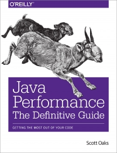

class: inverse, center, middle

# G1 Garbage Collector

IP Systems szakmai nap - 2015\. június 26.

.card[
* .card-img[]
* Viczián István
* @vicziani at Twitter
* http://jtechlog.hu
]

---

# G1 Garbage Collector

* Mi az a G1 (Garbage First) Garbage Collector?
* Hogyan működik?
* Mikor használjuk?
* Hogyan hangoljuk?

---

# Források

* Scott Oaks: Java Performance, The Definitive Guide
* [Getting Started with the G1 Garbage Collector](http://www.oracle.com/webfolder/technetwork/tutorials/obe/java/G1GettingStarted/index.html)
* [G1: One Garbage Collector To Rule Them All](http://www.infoq.com/articles/G1-One-Garbage-Collector-To-Rule-Them-All)
* [Java Platform, Standard Edition HotSpot Virtual Machine Garbage Collection Tuning Guide](http://docs.oracle.com/javase/8/docs/technotes/guides/vm/gctuning/)

---

# G1 céljai

* Java 7u4, előtte lévő JVM-ben experimental
* Szerver GC, többprocesszoros gépekre, sok memóriával
* Magas áteresztőképesség, minimális leállás
* CMS leváltására tervezték

---

# Alapfogalmak

* Weak generational hypothesis
* Permgen, metaspace
* Heap, stack
* Old/young gen (eden, survivor)
* Körkörös függőségek
* Stop the world
* Párhuzamos
* Konkurens
* Töredezettségmentesítés

---

# G1 tulajdonságai

* Négy fő művelet, fázisok
* Külön a young, külön az oldgen
* Bizonyos fázisok stop the world, bizonyos fázisok konkurensen
* Párhuzamos szálakat használ
* Töredezettségmentesít, nagyobb leállások nélkül
* Leállások hossza jobban megjósolható
* Nagy áteresztőképesség
* Full GC is előfordulhat
* Nagyobb CPU igény
* Minimálisan több memóriafelhasználás

---

# G1 megoldása

* Memória régiókra osztva, és ezek vagy eden, survivor, old, így flexibilisebb, nem fix méretűek
* Kettő hatvány, és próbálja a régiók számát 2048-on tartani
* Legtöbb szemetet tartalmazó régiókat üríti - innen a neve, próbálva betartani a célt, amennyit állhat (user defined pause time target), 
* Evakuálást használ, más régiókba másolja az objektumokat (felszabadítás, töredezettségmentesítés)
* Az, hogy mennyi régiót tud mennyi idő alatt felszabadítani, az előző futási idők alapján becsli
* Remembered Sets (RSets): 1 RSet/régió, objektum referenciák nyilvántartása, kisebb, mint 5%
* Collection Sets (CSets): GC által összegyűjtendő régiók, kisebb, mint 1%

---

# Műveletek

* Young collection - stop the world
* Background, concurrent cycle - stop the world, concurrent
* Mixed collection - stop the world
* Full GC - stop the world

---

# Background, concurrent cycle fázisai

* Initial mark - stop the world, young GC is, ha már áll
* Root region scan - nem futhat minor GC, ha szükség lenne, akkor a young GC bevárja, és csak utána fut
* Concurrent mark - concurrent
* Remark - stop the world
* Cleanup - stop the world
* Concurrent cleanup - concurrent

---

## Failure

* Concurrent mode failure: Concurrent mark beindul, de közben megtelik az old gen, marking cycle abort
* Promotion failure: mixed gc közben telik meg az old gen
* Evacuation failure: young gc közben telik meg az old gen 
* Humongous allocation failure: nagy objektumok (régiónál nagyobb)

---

# Tuning

* Old növelése vagy a heap, vagy a young/old arány változtatásával
* Háttérszálak növelése
* Gyakrabban fusson
* Több régiót szabadítson fel

---

# GC monitorozása

* `-verbose:gc` vagy `-XX:+PrintGC`
* `-XX:+PrintGCDetails`
* `-XX:+PrintGCTimeStamps` `-XX:+PrintGCDateStamps`
* `-Xloggc:filename`
* `-XX:+UseGCLogFileRotation`, `-XX:NumberOfGCLogFiles=N`, `-XX:GCLogFileSize=N`

---

# Paraméterezése

* `-XX:+UseG1GC`
* `-XX:MaxGCPauseMillis=N`, default 200
* `-Xmx(n)`
* `-XX:NewRatio=N`
* `-XX:ParallelGCThreads=N`
* `-XX:InitiatingHeapOccupancyPercent=N`
* `-XX:G1MixedGCLiveThresholdPercent=N`, telítettség függvényében, most 35%, de nem állítható csak fordított JDK esetén
* `-XX:G1MixedGCCountTarget=N`, max. mennyi ciklus alatt dolgozza fel a régiókat, default 8

---

# Java Mission Control

* Ingyenes fejlesztésre, éles környezetben Java SE Advanced licence vásárolandó
* JRockitből származik
* Egész rendszert, nem csak a JVM-et képes monitorozni

`-XX:+UnlockCommercialFeatures -XX:+FlightRecorder`

---

# Java Flight Recorder

* Hisztorikus rögzítés
* Template-ben adható meg, hogy mit gyűjtsön (exportálható, importálható, másolható)
* Kb. 1% overhead a default template-tel, 2% a profile template-tel
* JDK 8u45-ben 5.5.0
* Parancssorból is futtatható

---

# Miért jobb? Mikor használjuk? Mikor érdemes váltani?

* A ParallelOld GC az egész heapet töredezettségmentesíti, ezért sokáig tart
* CMS nem töredezettségmentesít

* Nagy heap (6G felett), de ne legyen hosszú megállás (tipikusan 0,5 sec alatt)
