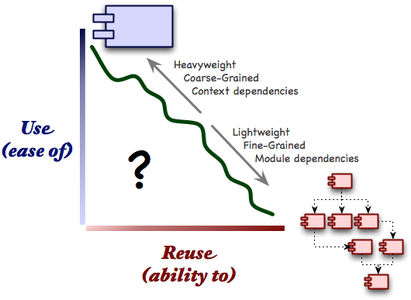
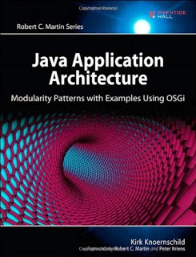
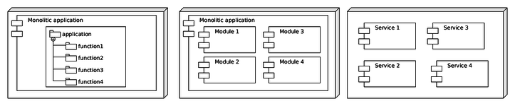
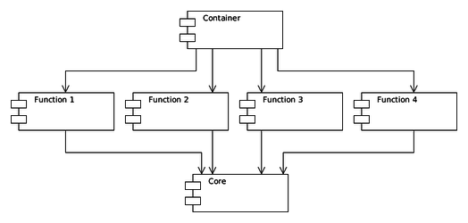

class: inverse, center, middle

# Modularizáció Servlet 3, Spring és Maven környezetben

HWSW free! Java meetup - 2015. augusztus

.card[
* .card-img[]
* Viczián István
* Java fejlesztő - [IP Systems](http://ipsystems.hu/)
* @vicziani at Twitter
* http://jtechlog.hu
]

---

# Miről lesz szó?

* Modulok szükségessége
* Modulok fogalma
* Modul tervezési minták
* Eszköztámogatás, mint Servlet 3, Spring és Maven

---

# Modul szükségessége

* Interfészek és osztályok finom szemcsézettségűek, újrafelhasználhatóságuk 
magas, nehezebben használhatóak
* Alkalmazások, szolgáltatások szemcsézettsége durva, újrafelhasználhatóságuk
alacsony, könnyebben használhatóak
* Újrafelhasználhatóság növelésével nő a komplexitás

---

# Modul tulajdonságai

* Deployable: külön telepíthető
* Manageable
 * Futás közben: külön indítható, leállítható
 * Fejlesztés közben: külön buildelhető, release-elhető, külön fejleszthető
* Testable: külön tesztelhető
* Natively reusable: metódushívással
* Composable: több modulból egy modul hozható létre
* Stateless unit: nem példányosítható, nincs állapota (az osztályokkal ellentétben)
* Concise interface: tömör interfész a használói számára

---

## OO alapok

* High cohesion
* Low coupling
* Single reposibility principle
* Well-defined interface

---

# Modul fogalma

* Java platformon nem más, mint a JAR állományok!

[Kirk Knoernschild: Java Application Architecture](http://www.amazon.com/Java-Application-Architecture-Modularity-Patterns/dp/0321247132)

---

# Modul mint fejlesztési egység

* Újrafelhasználhatóság?
* Az architektúra tükrözi a szervezeti felépítést
* Conway törvénye
* Kis létszámú agilis csapatok hajlamosabbak modularizált alkalmazás fejlesztésére
* Komplexitás csökkentése
* Konfliktusok minimalizálása
* Felelősség egysége
* Modul interfész egyben a csapatok közötti interfész

---

# Microservices

* Ígéretek: 
 * Külön fejleszhető, tesztelhető és telepíthető
 * Skálázható
 * Refaktorálható, cserélhető, akár teljesen eltérő nyelven, platformon, architektúrával
* Ha a monolitikus alkalmazásod sem felel meg az oo alapelveknek, akkor nem segít
* Új problémákat vezet be: latency, message serialization, fault tolerance, unreliable networks, distributed transactions, versioning, stateless
* Komplexitás ugyanúgy megvan, csak áthelyezted máshova (operational)

---

# Javasolt irány: robbanthatóság

* Továbblépni, csak ha szükséges:
 * Csomag alapú szeparáció
 * Külön JAR modulok
 * Külön release-elhetők
 * Akár dinamikus modulbetöltéssel
 * Csak részfunkcionalitás kivezetése microservice-be: export/import, riportolás
 * Microservices
* Hasonlat: dokumentumkezelés

---

# Tervezett modul függőségek

* Az architektúra jelenjen meg a kódban - [Coding The Architecture](http://www.codingthearchitecture.com/) - Simon Brown
 * Jelenjen meg a csomagokban, ellenőrzése [JDependdel](http://www.clarkware.com/software/JDepend.html)
 * Jelenjen meg a `pom.xml`-ekben, ellenőrzése Dependency Plugin `tree` és `analyze` goal

---

# Modulok szintekhez rendelése

* Legalacsonyabb szint: core module
* Közbülső szint: functional module
* Legmagasabb szint: container module
* Egymás után buildelendő, több szint bonyolítja a build folyamatot

---

# Core module

* Minden modulban újrafelhasználható komponensek
* Ide kerülnek az interfészek és default implementációk
* Ide kerülnek az események

---

# Funkcional module

* Üzleti funkciókat tartalmazza
* Speciális
 * Infrastruktúra
 * Kommunikációs
* Saját felhasználói felülettel rendelkezik
* Önmagában integrációs tesztelhető
* Önmagában, a többi modul nélkül indítható

---

# Container modul

* Közös funkciók: menükezelés
* Servlet 3.0 web fragment
* [WebJars](http://www.webjars.org/)
* Erőforrások a `META-INF/resources` könyvtárban
* Maven WAR overlay elkerülése
* Ebben kötelezően tesztelendő
* Csak ezt és a fejlesztett functional modult kell újrafordítani
* IDE támogatás a modulok feloldására

---

# Modulok kialakítása fizikai rétegek alapján

* Layerek fogalma
* Full stack developer
* Vágás funkciónként, csak azon belül layerenként
* Implementációs részlet?
* Lehet, technológiai kényszer külön projektként a frontendet
* Multimodule Maven project
* Maven prototype
* Spring ApplicationContext hierarchy

---

# Konténerfüggetlenség

* Könnyebben tesztelhető, portolható
* Dependency Injection: Spring XML vagy Java config
* Non-invasive
* Konfiguráció:
 * Modulonként egyedi
 * Convention over configuration

---

# Független konfiguráció

* A konfiguráció mindig a környezet része
* Spring Boot: [Externalized Configuration](http://docs.spring.io/spring-boot/docs/current/reference/html/boot-features-external-config.html)
* A Spring [Unified Property Management](http://spring.io/blog/2011/02/15/spring-3-1-m1-unified-property-management/) áll a háttérben (`Environment`, `PropertySource`)

---

# Publikált interfész

* Két megoldás
 * Szinkron hívás interfészeken keresztül
 * Eseménykezelés
* Standard Java-ban nincs megoldás az interfészek leválasztására
 * Maven: külön almodul, vagy attached artifact
 * OSGi service interface és implementation különválasztása (`Manifest.mf` állományban `Export-Package`)
 * Project Jigsaw (`module-info.java` állományban `exports`)
 * Spring Dynamic Modules: Pivotal átadta az Eclipse-nek
 * Impala: Dynamic modules for Spring-based app., 2013 óta áll
 * SpringSource dm Server: átadva az Eclipse-nek
 * Eclipse Virgo: utolsó kiadás 2014 július

---

# Teszt modul

* Funkcionális modul almodulja
* Konténer modulban funkcionális modulokon átnyúló integrációs tesztek
* Maven: nincs primary artifact
* Interfészen keresztül
* Spring ApplicationContext cache

---

# Összefoglalás

* Objektumorientált elvek használata
* Csomagokkal szervezett monolitikus alkalmazással induljunk
* Ne féljünk újrarendezni
* Később robbanthatunk
* Maven, Spring támogatja a modularizációs tervezési mintákat
