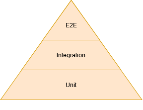
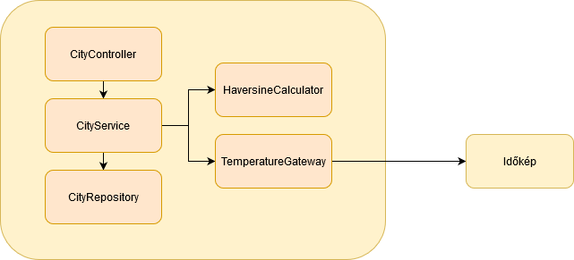
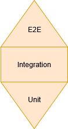
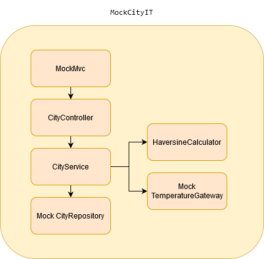
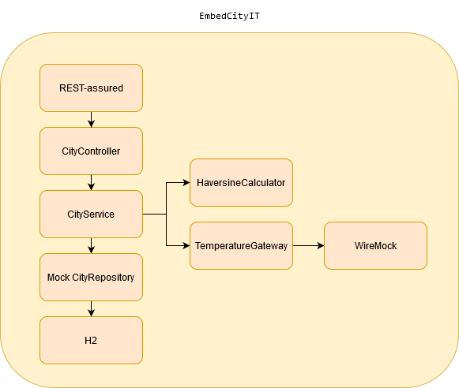
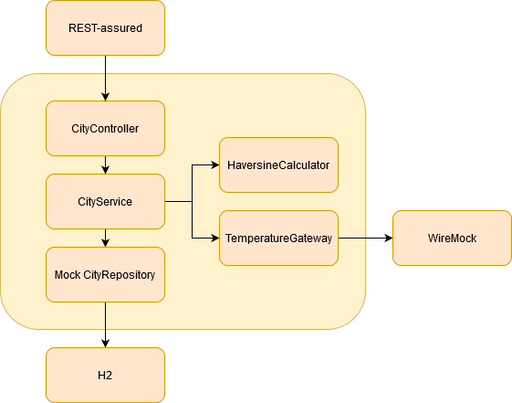

class: inverse, center, middle

# Integrációs tesztek nehézségei (Javaban)
 
## Viczián István   istvan.viczian@training360.com   http://jtechlog.hu   Nézz be a hype mögé! - Training360 meetup

---

## Tesztelés helyzete ma itthon a Training360 szemszögéből

* Egyre több tesztelőt keresnek
* A tesztelő a scrum csapat megbecsült tagja
* Igény van a fejlesztő bootcamphez hasonló tesztelői képzésekre (megcsináltuk!)
* Kezdő tesztelők zöme érdeklődik a tesztautomatizálás iránt
* Haladó tesztelők ebben az irányban látják a továbblépési lehetőséget
* Java/Python képzéseinken egyre több tesztelő
* Növekvő kereslet a tesztautomatizálással kapcsolatos képzésekre

---

## Tesztpiramis

* Unit tesztek: adott programozási nyelv legkisebb részeit tesztelik
* Integrációs tesztek: csoportba szervezett egységek tesztelése, nem nyúlik át másik rendszerekbe
* E2E: szoftverrendszer tesztelése adott környezetben, külső függőségeivel integrálva, funkciók, folyamatok tesztelése az elejétől a végéig

---

## Kérdéseim

* Szolgáltatás teszt (service test), komponens teszt (component test), rendszerteszt (system test) vajon mi?
* Vajon mik a magyar elnevezések?
* E2E tesztelés arra utal, hogy a felhasználói felületen át tesztelünk az adatbázisig és az integrálódótt rendszerekig? Vagy a folyamatokat teszteljük az elejétől a végéig? Eleje felület vagy kapcsolódó rendszer? Vége felület, adatbázis vagy másik rendszer?
* E2E csak felhasználói felület (UI) vagy programozói felület tesztelés is? (API)
* Nincs egységes terminológia!
* Hogy néz ki mindez microservices környezetben?

---

## Vizsgálat tárgya

* Spring Boot microservice saját (egyelőre relációs) adatbázissal
* Háromrétegű alkalmazás
* RESTful webszolgáltatás API
* Opcionálisan valami JavaScript felület
* Külső kapcsolatok (Gateway)
    * Szinkron, pl. RESTful API
    * Aszinkron, pl. MOM
* Önmaga microservice, microservice architektúrába integrálódva

---

## Microservice

---

## Test harness helye

* A test harness az architektúra része!
* Az architektúra külső körén helyezkedik el
* A tesztesetek függnek a kódtól, a kód nem függ a tesztesettől
* Alkalmazástól külön telepíthető, de telepítendő
* Része a rendszer tervezésének
* Tehetünk-e production kódba tesztelést támogató részeket?

---

## Unit tesztelés ígéretei

* Hibák mielőbbi megtalálása, ezáltal költségcsökkentés
* Refactoring támogatása
* Komplex rendszer esetén hamarabb találjuk meg a hibás komponenst
* Komponensek közötti interakció és függőségek mielőbbi átgondolása
* Tiszta API, lazán kapcsolt kód

---

## Unit tesztelés megközelítései

* Állapot alapú: a megfelelő bemenetre az elvárt kimenetet kapjuk eredményül
* Viselkedés alapú: a megfelelő osztályokkal a megfelelő módon működött együtt: mockolás

---

## Kételyeim a unit teszteléssel kapcsolatban

* Rettentő finom granuláltság, amennyiben átszervezünk, sok tesztesetet érint
    * Akadályozza a magasabb szintű refactoringot
    * Implementációs részleteket tesztel
* Viselkedés alapú tesztelés: loose coupling megsértése, nem csak a publikus API-ját ismeri, hanem hogy mit hív tovább
    * Mock, verify, argument matcher

---

## Unit tesztelés - prezentációs réteg

* JSON konvertálás - deklaratív - library tesztelés
* Egyszerűbb validációk - deklaratív (Bean Validation) - library tesztelés
* HTTP és Java objektumok közötti megfeleltetés (státuszkód, header, stb.) - sok deklaratív - library tesztelé
* Logika, elágazás nélküli - delegál
* Bonyolultabb validációk - OK - ki ír meg elsőre regexp-et?
  
---

## Unit tesztelés - üzleti logika réteg

* Delegál a perzisztens réteg felé
* Ciklusok, elágazások bonyolultabb feltételek alapján - OK
* Konvertálások (ModelMapper, JMapper, MapStruct, Dozer, Orika) - deklaratív - library tesztelés

---

## Unit tesztelés - perzisztens réteg

* `Connection`, `EntityManager` mockolás?
* Spring Data JPA - generált implementáció, jobbára deklaratív - framework tesztelés
* Entitások mappelése (JPA annotációk) - nem unit tesztelhető

---

## Unit tesztelés - integrációs réteg

* Mapping - deklaratív
* Technológia, API (REST, JMS) - library tesztelés
    
---

## Unit teszt konklúzió

* Akkor érzem jól magam, ha olyan Java SE kódot tesztelek, melyet nem írok meg elsőre

---

## E2E ígéretei

* Rendszer teszelése a felhasználó szemszögéből
* Teljes üzleti folyamatok tesztelése
* Rendszer tesztelése a környezetével integrálva

---

## Kételyek az E2E teszteléssel   kapcsolatban

* Teszt környezetben elérhetőek a kapcsolódó rendszerek? Olyan állapotban vannak, hogy támogatják a tesztelést?
* Ne függj törékeny, gyakran változó dolgoktól, mint a GUI
    * Fragile Test Problem - változik a GUI, változtatni kell a teszteseteket
* Magas teszteset karbantartási költség
* Magas test harness üzemeltetési költség (böngészők - (virtuális) felület)
* Microservice környezetben magas microservice üzemeltetési költség
    * Konténer technológia, konténer orchestration nélkül megoldhatatlan
* Lassú

---

## E2E konklúzió

* Akkor érzem jól magam, ha kevés teljes folyamaton átívelő, több lépésből álló E2E
tesztem van, ami a core üzleti funkcionalitást teszteli (happy path), (sanity)
* Ha nem törik el: jön a pénz
* Ha eltörik: nem jön a pénz
* Tesztelés élesben
    * Blue/Green - átkapcsolás tesztelt, párhuzamos környezetre (teszt adatok élesben)
    * Canary release - folyamatos átterhelés
    * Feltételei: monitorozás, visszaállás

---

## Integrációs tesztelés a megoldás?

* Legkisebb munkával legnagyobb lefedettség
* Engedi a refactoringot, API maradjon változatlan
* Ellenőrizhetőek a 3rd party library-k helyes használata (Spring MVC, JSON mapping, Bean Validation, bean konvertálás, JPA mapping, lekérdezések)
* Nem olyan lassú a futtatása
* Még nem jön be a más rendszerekkel való integráció problémája

---

## Tesztpostairón

Testing honeycomb (Spotify)

---

## Integrációs tesztelés   repo/gateway mock

---

## Gateway mockolás

* Szimulálható a rossz válasz is
* Szimulálható a késleltetés is

---

## Integrációs tesztelés   embedded módon

---

## Integrációs tesztelés   memórián kívül

---

## Contract testing

* Inkompatibilis API módosítás csak integrációkor derül ki
* Szolgáltatás hívója rögzíti, hogyan hívja a szolgáltatást
    * Szolgáltatás tesztesetei közé kéne bekötni - pull request - meg tudom írni?
    * Testing by example
    * Ha visszafele nem kompatibilisan módosít - elbukik a teszt
* Spring Cloud Contract
    * Leírjuk a kommunikációt (milyen kérésnél milyen válaszra várunk) és mindkét oldalon tesztesetként jelenik meg
    * Hívott oldalon egy REST-Assured tesztesetet generál
    * Hívó oldalon egy WireMock-ot

---

## Összefoglalás   Tedd fel magadnak a kérdést!

* Mennyit kell vele foglalkozni?
* Megéri?
* Jól érzed magad, miközben írod?
* Tizedjére is?
* Jól érzed magad, mikor futtatod?
* Tizedjére is?
* Kételkedj!

---

## Irodalom

* [Ham Vocke: The Practical Test Pyramid on martinFowler.com](https://martinfowler.com/articles/practical-test-pyramid.html)
* [Toby Clemson: Testing Strategies in a Microservice Architecture on martinFowler.com](https://martinfowler.com/articles/microservice-testing/)
* [Chris Richardson: Microservices patterns](https://microservices.io/book)
* [Testing of Microservices: André Schaffer on Spotify Labs](https://labs.spotify.com/2018/01/11/testing-of-microservices/)