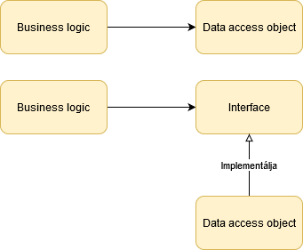

class: inverse, center, middle

# Clean Architecture, 12 Factor App és a DDD vitatottabb állításai

---

## Alerant - 2020. június

.card[
* .card-img[]
* Viczián István
* Java fejlesztő, oktató - Training360
* http://jtechlog.hu
]

---

## Clean Architecture

* Robert C. Martin: Clean Architecture
* Objektumorientált alapelveket alkalmazza magasabb absztrakciós szinten (komponens)
  * Az alapelveket, a döntések miértjét mindenképpen érdemes ismerni
  * A választott megoldás nem elterjedt, a klasszikus 3-rétegű architektúrához képest
      szignifikáns eltérés van

---

## Architektúra fogalma

* Tervezési döntések
* Jellemzője, hogy mindig kevesebbet tudunk, mint amennyi a döntéshez szükséges lenne
* Megoldás: döntés elhalasztásának elve (Meglepetés No. 1.)
  * Példa: Java SE-vel lefejleszteni az üzleti logikát adatbázis és felület nélkül
  * Komponens struktúra nehezen tervezhető meg az elején top-down módon
* Ennek feltétele, ha a felkészülünk a változásra
* Architektúra célja: legkevesebb emberi erőforrásból elkészíteni és karbantartani a szoftvert
* Architekt: egy jó programozó (Meglepetés No. 2.), aki a programozási feladatain felül a csapatát a megfelelő tervezési döntésekkel a maximális hatékonyság felé tereli
* Új igény nem feltétlen illik bele az architektúrába: módosítást igényel
  * Egyik legerőforrásigényesebb, megtalálni a bővítési pontot (kép: puzzle)

---

## OO előnyei

* Egységbezárás (már létezett nem oo programozási nyelvekben - Meglepetés No. 3.)
* Öröklődés (már létezett nem oo programozási nyelvekben - Meglepetés No. 4.)
* Polimorfizmus (ez a valódi előny - Meglepetés No. 5.)

---

## Dependency inversion

* Dependency inversion (NEM injection) - (Meglepetés No. 6.)
* A függőség megfordítható a program folyásával ellenkező irányba (hívási lánc)
* Architektúra szempontjából nagyon fontos
* A függőség iránya nem egyezik meg a hívás irányával



---

## Dependency inversion a gyakorlatban

* Mikor használjunk interfészeket?
* Mindig? A `String` osztálynál is?
* Ha tesztelni akarjuk?

---

## Liskov substitution principle

* Ennek klasszikus megsértése a téglalap - négyzet példa (Meglepetés No. 7.)

```java
var square = new Square();
square.setWidth(10);
square.setHeight(20);
System.out.println(square.getArea()); // 200 vagy 400?
```


(Meglepetés No. 8.?)

---

## Mikor írjunk felül egy metódust?

* Sértheti a Liskov-elvet
* Soha... (Meglepetés No. 9.?)
* Helyette absztrakt metódust implementáljunk (interfész, absztrakt ősosztály)

---

## Függőségek

* Tranzitív függőségek
  * Nem kell feltétlen minden belőle
  * Több kisebb
  * Opcionális legyen
* Verziószám intervallumok? (Meglepetés No. 10.?)

---
  
## Stable Dependencies Principle

* Nehezen módosítható komponens ne függjön gyorsan változó komponensen
* Nagyon nehezen módosítható az a komponens, melyen sokan függenek
* Stabil modulokra kell építeni az erősebben változókat

---

## Szoftver felosztása Clean Architecture szerint

* Policy: üzleti szabályok, az üzlet számára ez az érték
  * Funkcionális követelményekre válasz
  * Önmagában tesztelhető
  * Keretrendszer, DB és UI független (ORM, ResultSet rossz)        
  * Klasszikus programozási adatszerkezetek, mint set, list, map, queue, tree, stb.
* Details: lehetővé teszik a szereplők számára az üzleti szabályokhoz való hozzáférést
  * Nem-funkcionális követelményekre válasz
  * IO, adatbázis, futtatókörnyezet, keretrendszer, kommunikációs protokollok
  * Csak ebben szerepelhetnek konfigurációk, fizikai elérések

---
        
## Clean architecture


---

## Döntés elhalasztásának <br /> az elve

* Nem kell korán DB gyártót választani
* Nem kell korán felületi technológiát választani
* REST-t API-t nem kell kitalálni (API-first?)
* Nem kell DI keretrendszert választani
* Ha már a döntés megszületett, akkor is kezeljük, mintha nem
* Minél később döntünk, annál több információ áll a rendelkezésünkre

---

## Komponensekbe szervezés

* Komponensek elválasztásának módja
  * Csomag/névtér szinten (source level)
  * In-process, de külön deployment/release (deployment level - JAR, DLL)
  * Külön process (service level)
* Továbblépés a SOA vagy microservices felé
* Kezdetben legyen egyben, de le lehessen módosítani (Meglepetés No. 11.?)
  * Mérés alapján, hiszen előre nem gondolhatjuk, mit kell külön skálázni
  * Minden irányba, microservice-eket később egybe is olvaszthatunk
  * Klasszikus rossz példa: külön szervereken futó három réteg, hálózati kommunikációval
          (Egy mező bevezetése rengeteg plusz munkával jár)
          
---

## Duplikálás

* Duplikálás NEM mindig rossz (Meglepetés No. 12.?)
* Példa: két nagyon hasonló CRUD képernyő, különálló entitásokon
* Ami külön változik, külön legyen
* Ezen képernyőknek különböző lesz az életútja
* Felesleges absztrakció közös részeket kiemelni
* Tilos pl. ugyanazt az entitást használni különböző rétegek között, különböző képernyőkön, in/out paraméterként
  * Ismétlés van
  * Másolást végző library-k
      
---

## Tesztek

* A tesztek az architektúra részei (Meglepetés No. 13.?)
* A legkülső körön helyezkednek el
* Fragile test problem: egy változtatás nagyon nagy mennyiségű tesztet tör el
  * Klasszikus hozzáállás nem feltétlen jó: minden osztály minden metódusához
* Nem függhet változó dolgokon: pl. GUI (Meglepetés No. 14.?)

---

## Twelve-factor app

* [Twelve-factor app](https://12factor.net/) egy manifesztó, metodológia felhőbe telepíthető alkalmazások fejlesztésére
* Heroku platform fejlesztőinek ajánlása
* Előtérben a cloud, PaaS, continuous deployment


---

## Konkurrencia

* Különböző típusú folyamatok különválasztása, folyamatvezérlővel felügyelni (Meglepetés No. 15.?)
* Típusai
    * Web alkalmazások: sok rövid párhuzamos kérést
    * Kevésbé kritikus válaszidő: képekhez bélyegkép generálás,
    PDF dokumentumok generálása, hírlevelek kiküldése, számlák generálása, elszámoló batch folyamatok

---

## Naplózás

* Nem az alkalmazás feladata a napló irányítása a megfelelő helyre, vagy a napló tárolása, kezelése, archiválása, görgetése, stb.
* Írjon konzolra (Meglepetés No. 16.?)

---

## Hiány

* (Meglepetés No. 17.?)
* Telemetry
* Authentication and Authorization
* Kevin Hoffman: Beyond the Twelve-Factor App (O'Reilly)

---

## DDD

* DDD: modellezési eszközök, minták
* A legtöbb architektúrával használható: Event driven architecture, CQRS, Reactive and actor model, REST, SOA, microservices, cloud
* Bounded context, Ubiquitous language (ugyanarra a fogalomra ugyanaz a szó)
* Value objects (soha BigDecimal, float pénz tárolására): immutable, auto validation, domain logic, eq, thread safe (Meglepetés No. 18.?)
* Entity: id, value objects és más entitásokkal kapcsolat, sor az adatbázisban, mutable
* Aggregate
  * Túl bonyolult objektum gráf
  * Egy tranzakciónyi
  * Root entity - teljes életciklust vezérli
  * Mindig konzisztens állapotban van
  * Más aggregate-ekkel id szinten (Meglepetés No. 19.?)
  * Repository: egy aggregate betöltése (root + kapcsolatok)


---

## Arany kalapács

* Kognitív torzítás
* Abraham Maslow (és piramisa)
* (Meglepetés No. 20.?)